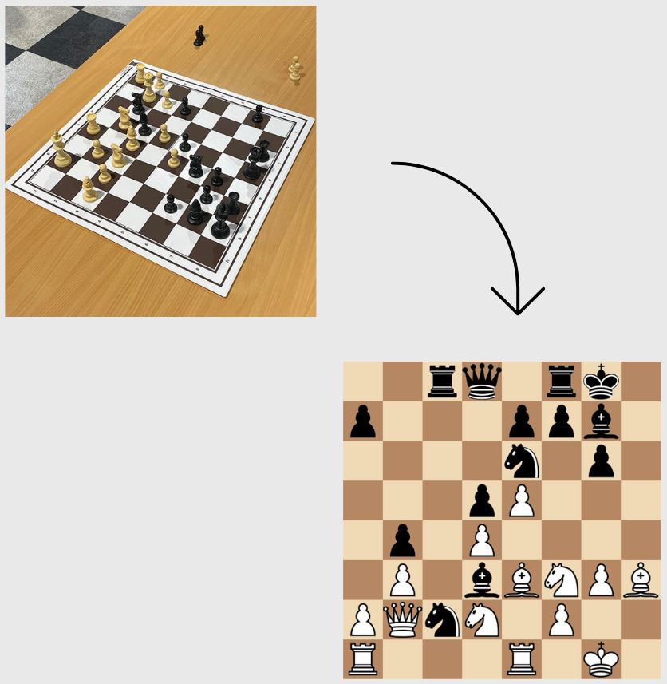

# Chess Visualizer: Real-time chessboard digitization on Android

<p align="center">
  
</p>

**Chess Visualizer** is an Android application project that uses computer vision and deep learning to recognize physical chess positions and convert them into digital format in real-time.

Powered by **YOLO11** models optimized for mobile, the app performs full on-device inference to segment chessboards, detect pieces, and reconstruct the game state.

---

## 📱 Android Demo

<p align="left">
  
</p>

The app runs entirely on-device, allowing users to:
1.  Point the camera at a physical chessboard.
2.  Adjust the orientation (e.g., White at the bottom).
3.  Instantly generate a 2D SVG representation of the game.

---

## 🚀 Key points

This project demonstrates the deployment of state-of-the-art object detection models on edge devices without relying on heavy external libraries for inference logic.

* **YOLO11 on Android**: Successfully ported Ultralytics YOLO11 segmentation and detection models to Android using TFLite.
* **Custom inference pipeline**: Implemented a raw Java-based inference pipeline. This project handles:
    * **Non-Maximum Suppression (NMS)** to filter overlapping bounding boxes.
    * **Coordinate Rescaling** to map model outputs back to the original camera resolution.
    * **Output Parsing** for both segmentation masks and detection boxes.
* Utilizes **OpenCV** for perspective warping and homography transformations to map 2D image coordinates to the 8x8 chess grid.

## How it works

<p align="left">
  
</p>
*Left: YOLO-Seg identifying the board area. Right: YOLO-Det localizing individual pieces.*

The application follows a multi-stage pipeline to process every frame:

1.  **Board segmentation (YOLO11-seg)**: The model identifies the chessboard and extracts the four corners of the playing area.
2.  **Perspective correction**: Using OpenCV, the angled board image is "warped" into a top-down orthogonal view.
3.  **Piece detection (YOLO11-det)**: A second model detects all chess pieces on the board.
4.  **Square mapping**: The center of each detected piece bounding box is mapped to the warped 8x8 grid to determine its rank and file.
5.  **FEN Generation**: The logical state of the board is converted into a Forsyth–Edwards Notation (FEN) string and rendered using a scalable vector graphic (SVG).

## 📊 Performance & Challenges

The system was evaluated on a test set of **843 mixed images** (combining real-world photos and synthetic renders).

| Metric | Result |
| :--- | :--- |
| **Zero errors (Perfect board)** | **66.19%** |
| **<= 1 error** | **79.00%** |
| **<= 2 errors** | **83.51%** |

### Insights & Limitations

While the **localization** (finding where pieces are) is highly robust, the model currently faces challenges with **fine-grained classification** (e.g., distinguishing a white Bishop from a white Pawn) when tested on chess sets different from the training data.

* **The bottleneck**: The primary limitation is the lack of a diverse public dataset containing various physical chess piece styles.

## Tech stack

* **Mobile**: Android SDK (Java)
* **Computer Vision**: OpenCV for Android
* **ML Inference**: TensorFlow Lite (Float16/Float32 quantization)
* **Training**: Python, Ultralytics YOLO11, PyTorch
* **Scripting**: Chaquopy (for Python logic integration on Android)

## 📂 Project structure

```text
chess-visualizer/
├── android/          # Android Studio project source code
│   ├── app/src/main/java/  # Core logic (Camera, NMS, UI)
│   └── app/src/main/assets/ # TFLite models
├── python/           # Training and utility scripts
│   ├── training/     # YOLO training configurations
│   ├── inference/    # Inference prototypes on PC
│   └── tools/        # Dataset formatting and preprocessing
└── README.md